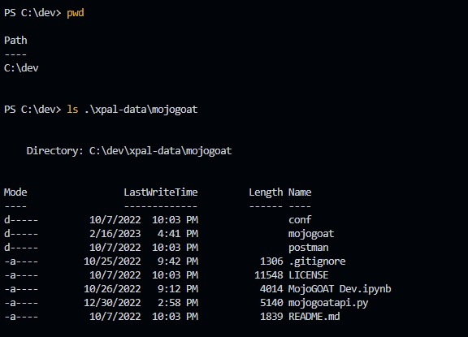
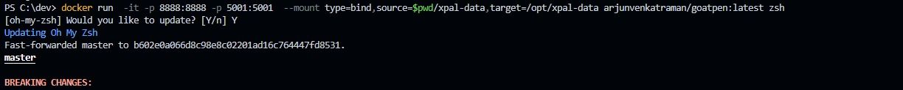
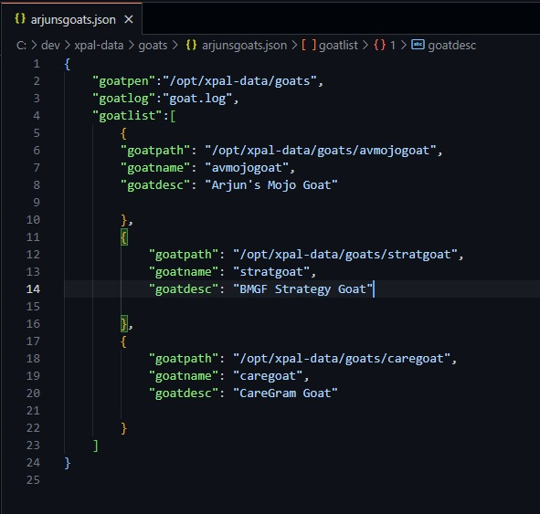
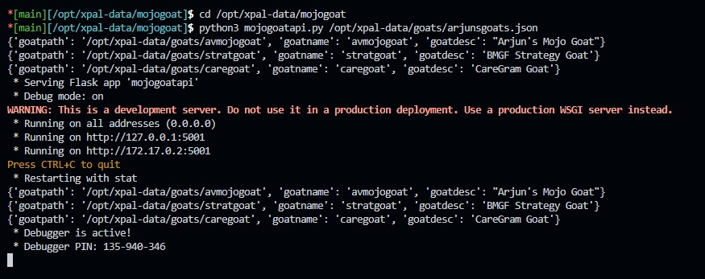
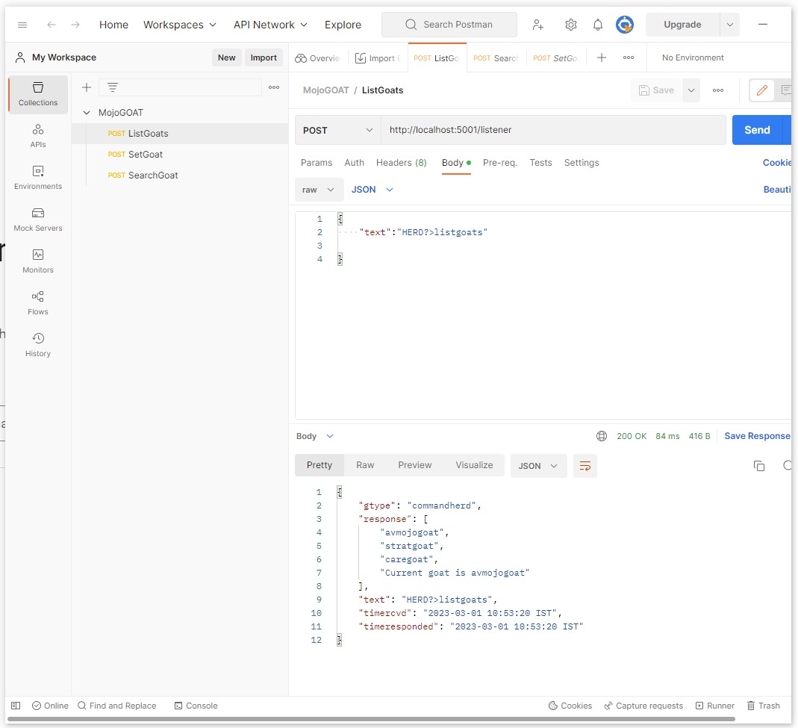
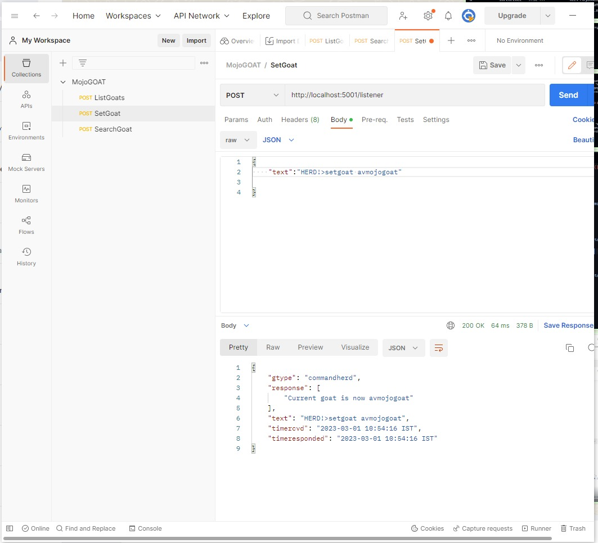

# MojoGOAT - A Graph Of All Things

## Overview

GOATs help structure information sematically by taking an ontological rather than a taxonomical approach.
In this implementation of the GOAT, we use a "quad" as the semantic structure: `<source><story><target><date>`

A set of quads can be represented as a table, a CSV, a plain delimited text, or a more complex data structure
The GOAT takes a set of quads and sets up a way to feed it into a neo4j graph database using python bindings. The graph data structure, as well as the simplified underlying quad storage can be queried using a simple REST API

## GOAT Sutras

1. You can own a GOAT, some GOATs, many GOATs, big GOATs, small GOATs, public GOATs, private GOATs and so forth but no one owns THE GOAT
2. GOATs will eat almost everything, don't feed a GOAT rubbish unless you want a sick GOAT
3. When a GOAT gets too fat, make biryani

## Set up the GOATPen

[GOATPen Docker Image](https://hub.docker.com/r/arjunvenkatraman/goatpen)

Install Docker on your machine, then use a terminal to run the following command

```
docker pull -a arjunvenkatraman/goatpen
```

Then start a container using the following command

```
docker run  -it -p 8888:8888 -p 5001:5001  --mount type=bind,source=$pwd/xpal-data,target=/opt/xpal-data arjunvenkatraman/goatpen:latest
```

Attach a shell to the running container to get a command line

## Screenshots









## GOAT API

The GOAT API allows for interaction with the GOATs you have access to. To start the API attach a terminal to the running docker container and run the following command:

```
cd /opt/xpal-data/mojogoat
python3 mojogoatapi.py
```

The API should now be accessible at http://localhost:5001

You can use the Postman collection included with the repository (in the `postman` folder) to test the API
