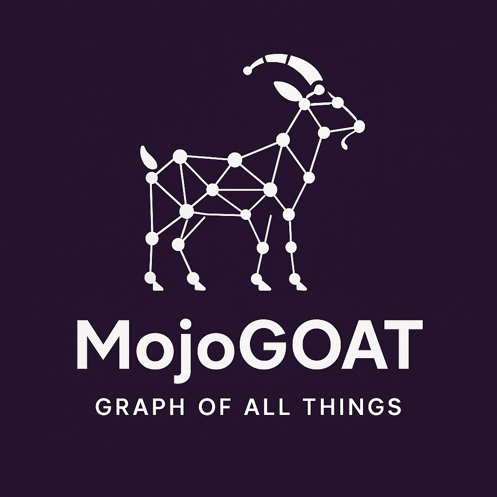

# MojoGOAT - A Graph Of All Things

<p align="center">
  
</p>

## Overview

MojoGOAT helps structure information semantically by taking an **ontological** rather than a **taxonomical** approach. While a taxonomical approach organizes information into hierarchical categories, an ontological approach focuses on the relationships and connections between concepts, offering greater flexibility and depth. This allows for a more relational method of organizing and querying data.

### Semantic Structure: The Quad

In this implementation, we use a "quad" as the semantic structure: `<source><story><target><date>`. Each quad represents a relationship between entities or concepts within a specific context and timestamp, enabling rich, interconnected data representations. For example:

```
PersonA|knows|PersonB|2025-01-05
```

This indicates that PersonA knows PersonB as of the specified date.

Quads can be represented in various formats, such as:

- Tables
- CSV files
- Plain delimited text
- JSON structures

The MojoGOAT framework facilitates the ingestion of these quads into a Neo4j graph database using Python bindings. Nodes are stored as JSON objects, with the `nodeid` used as a reference in other data representations.

---

## GOAT Sutras

1. **Ownership Principle**: You can own a GOAT, some GOATs, many GOATs, big GOATs, small GOATs, public GOATs, private GOATs, and so forth, but no one owns THE GOAT. The GOAT is a shared resource, open for exploration and extension.
2. **Data Integrity Principle**: GOATs will eat almost everything, but feeding them rubbish will result in a sick GOAT. This emphasizes the importance of clean, structured, and meaningful data.
3. **Scalability Principle**: When a GOAT gets too fat, make biryani. This is a metaphor for managing and scaling data effectively when the graph becomes too large or unwieldy.

---

## Installation

Follow these steps to set up and use the MojoGOAT system.

### 1. Set Up the Docker Image

The GOAT system uses a Docker image to simplify setup and ensure a consistent environment across different machines.

#### Steps:

1. **Install Docker**  
   Download and install Docker from [Docker’s official website](https://www.docker.com/products/docker-desktop).

2. **Create Local Directory Structure**  
   Run the following commands to create the necessary directories:
   ```sh
   mkdir -p ./dev/xpal-data
   mkdir -p ./dev/xpal-src
   ```
   These commands create the `xpal-data` and `xpal-src` directories under the `./dev` directory.

3. **Pull the Xetrapal Docker Image**  
   Run:
   ```sh
   cd dev
   docker pull -a arjunvenkatraman/xetrapal
   ```

4. **Start a Docker Container**  
   Run:
   ```sh
   docker run -it -p8888:8888 -p5000:5000 \
       --mount type=bind,source=$PWD/xpal-data,target=/xpal-data \
       --mount type=bind,source=$PWD/xpal-src,target=/xpal-src \
       arjunvenkatraman/xetrapal:latest zsh
   ```
   - `-it`: Starts the container in interactive mode with a terminal.
   - `-p8888:8888`: Maps port 8888 for Jupyter Notebook access.
   - `-p5000:5000`: Maps port 5000 for REST API access.
   - `--mount`: Binds local directories to the container for data persistence.

5. **Attach a Shell**  
   Attach a shell to the running container to access its command line.

---

### 2. Run a Jupyter Notebook

1. **Start Jupyter Notebook**  
   Inside the Docker container, run:
   ```sh
   cd /
   jupyter notebook --allow-root --ip 0.0.0.0
   ```

2. **Access Jupyter Notebook**  
   Copy the link provided in the terminal (e.g., `://127.0.0.1:8888/?token=<TOKEN>`) and open it in your browser.

3. **Set Up Your Workspace**  
   - Navigate to the `xpal-data` directory.
   - Create a new folder for your project.
   - Create a new Jupyter Notebook file to begin your work.

---

### 3. Connect to the Neo4j Database

Neo4j serves as the backbone of the GOAT system, providing a graph database for storing and querying quads.

#### Steps:

1. **Create a Configuration File**  
   In the `xpal-data/conf` directory, create a `.json` file with the following format:
   ```json
   {
       "database": "neo4j",
       "url": "<NEO4J DB URL>",
       "password": "<NEO4J DB PASSWORD>"
   }
   ```
   Replace `<NEO4J DB URL>` (e.g., `bolt://localhost:7687`) and `<NEO4J DB PASSWORD>` with your Neo4j credentials.

2. **Test the Connection**  
   Use your Jupyter Notebook to load this configuration file and test the connection to the Neo4j database.

---

### 4. Set Up a Neo4j Free Instance

Neo4j offers a free instance for small-scale projects and experimentation.

#### Options:

1. **Local Installation**  
   - Download Neo4j from [Neo4j’s official website](https://neo4j.com/download/).
   - Follow the installation instructions for your OS.  
   *(Note: Local installations can be resource-intensive.)*

2. **Cloud Option**  
   - Use [Neo4j Aura](https://neo4j.com/cloud/aura/), a cloud-hosted version of Neo4j with a free tier.

3. **Configure and Start**  
   - For local setups, start the Neo4j server and ensure it’s running on the default Bolt protocol (`bolt://localhost:7687`).
   - For cloud setups, use the provided connection details.

---

By completing these steps, you’ll have a fully functional MojoGOAT system ready to organize, query, and explore interconnected data using Neo4j and Jupyter Notebook.


---

## API Usage

MojoGOAT provides a comprehensive REST API for interacting with goat databases. The API allows you to:

1. **Manage Goats**
   - Create and register different types of goat databases (text, Neo4j, MongoDB+PostgreSQL)
   - Select active goat for operations
   - Specify registry location

2. **Node Operations**
   - Create, read, update, and delete nodes
   - Query nodes by ID or label

3. **Relationship Operations**
   - Create, read, and delete relationships
   - Query relationships by source, target, or story

For detailed API documentation, see `API_README.md`.

## Testing Framework

MojoGOAT includes a comprehensive testing framework to validate its functionality:

1. **API Unit Tests**
   - Python unittest framework for API endpoint testing
   - Located in `/test/test_api.py` and `/test/test_api_crud.py`

2. **CLI Test Tool**
   - Command-line tool for testing all API endpoints
   - Located in `/test/test_api_cli.py`

3. **Postman Collection**
   - GUI-based API testing using Postman
   - Located in `/postman/MojoGOAT_API_Tests.postman_collection.json`

4. **MongoDB+PostgreSQL Tests**
   - Validate the hybrid database functionality
   - Located in `/test/test_mongodbpostgres_*.py`

To run all tests:

```bash
cd /xpal-src/mojogoat/test
./run_all_tests.sh
```

For detailed testing documentation, see `API_TEST_README.md`.
EOL < /dev/null